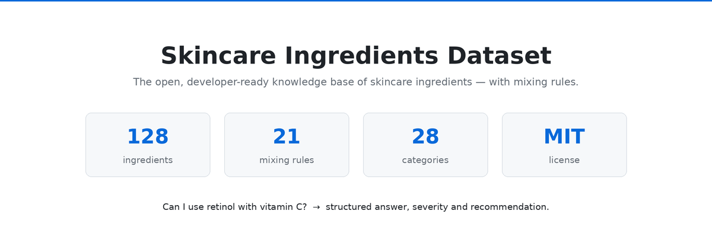
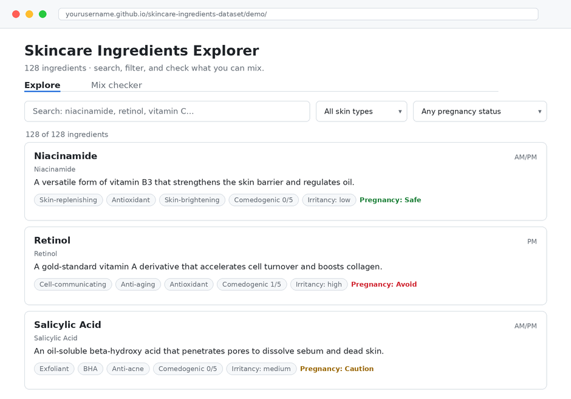
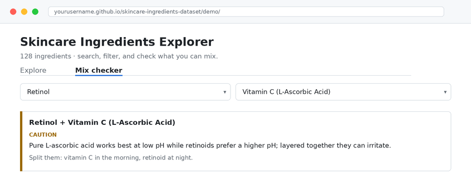

<div align="center">



# Skincare Ingredients Dataset

### Free & open-source database of skincare ingredients — INCI names, benefits, skin types, comedogenic ratings, pregnancy safety, and an ingredient compatibility engine.

A clean, structured, **developer-ready** dataset of **128 cosmetic ingredients** for building skincare apps, AI routine planners, ingredient analyzers, and recommendation systems. Every ingredient is profiled in plain language and ships in **JSON, CSV, and minified JSON** — plus a machine-readable **"what can I mix?" compatibility engine** that no other open dataset has.

[](./data/ingredients.json)
[](./data/categories.json)
[](./data/compatibility_rules.json)
[](./LICENSE)
[](./CONTRIBUTING.md)

**Star this repo if it saves you time — it helps other builders find it.**

[Live demo](./demo/index.html) · [Browse the data](./data/ingredients.json) · [Compatibility rules](./data/compatibility_rules.json) · [Contribute](./CONTRIBUTING.md)

</div>

---

## Table of contents

- [What you get](#what-you-get)
- [Screenshots](#screenshots)
- [Why this dataset exists](#why-this-dataset-exists)
- [Data schema](#data-schema)
- [The ingredient compatibility engine](#the-ingredient-compatibility-engine)
- [Dataset statistics](#dataset-statistics)
- [Quick start](#quick-start)
- [Command-line tools](#command-line-tools)
- [Repository structure](#repository-structure)
- [Who is this for](#who-is-this-for)
- [Roadmap & contributing](#roadmap--contributing)
- [FAQ](#faq)
- [Keywords](#keywords)
- [Disclaimer](#disclaimer)
- [License](#license)

---

## What you get

| | |
|---|---|
| **128 ingredients** | Actives, acids, humectants, oils, ceramides, peptides, sunscreen UV filters, preservatives, surfactants and more |
| **20+ fields per ingredient** | INCI name, synonyms, function, benefits, suitable skin types, comedogenic rating, irritancy, pregnancy safety, vegan status, origin, typical concentration, optimal pH, AM/PM use, evidence level, pairings |
| **Compatibility engine** | 21 pairwise mixing rules across 15 ingredient groups — `avoid` / `caution` / `great` / `essential`, each with a reason and a recommendation |
| **Category glossary** | Plain-English definitions for all 28 functional categories |
| **Every format** | `JSON`, minified `JSON`, `CSV`, and one file per category |
| **Zero-dependency tooling** | Python scripts to build, validate, search and run mixing checks |
| **Live demo** | A single-file HTML explorer + mix checker — no backend, works on GitHub Pages |
| **MIT licensed** | Free for commercial and personal projects |

---

## Screenshots

**Browse, search and filter 128 ingredients** by skin type and pregnancy safety:



**Check what you can layer** — the mix checker returns a verdict, the reason, and how to schedule the two ingredients:



> The demo is a single self-contained `demo/index.html` — open it locally or host it on GitHub Pages. All data is embedded, so it works offline.

---

## Why this dataset exists

If you have ever tried to build a **skincare app**, an **AI routine planner**, or an **ingredient analyzer**, you have hit the same wall: there is no clean, structured, human-readable dataset of skincare ingredients.

What exists today is either:

- **Raw chemical identifiers** (INCI, CAS, EINECS, COSING IDs) — perfect for chemists, useless for a product UI or a recommendation model, or
- **Commercial databases** locked behind paywalls and restrictive licences.

This project fills the gap. Every ingredient is written the way a **product** actually needs it — plain-language descriptions, real benefits, who it suits, and what it conflicts with. Drop it straight into your UI, your recommender, or your LLM prompt.

**The part nobody else has:** a machine-readable **ingredient compatibility engine**. Ask "can I use retinol with vitamin C?" and get a structured answer with a severity, a reason, and a recommendation. This is the feature that makes skincare apps genuinely useful instead of just pretty.

---

## Data schema

Each of the 128 records follows the same shape (validated against [`schema/ingredient.schema.json`](./schema/ingredient.schema.json)):

```jsonc
{
  "id": "niacinamide",                       // unique slug
  "inci_name": "Niacinamide",                // official INCI label name
  "common_name": "Niacinamide",
  "also_known_as": ["Nicotinamide", "Vitamin B3"],
  "category": ["Skin-replenishing", "Antioxidant", "Skin-brightening", "Soothing"],
  "description": "A versatile form of vitamin B3 that strengthens the skin barrier and regulates oil.",
  "benefits": ["Minimizes appearance of pores", "Evens skin tone", "Strengthens moisture barrier"],
  "skin_types": ["all", "oily", "acne-prone", "sensitive"],
  "concerns": ["Very high concentrations (>10%) can cause flushing in some users"],
  "comedogenic_rating": 0,                   // 0 (non) .. 5 (highly pore-clogging)
  "irritancy": "low",                        // low | medium | high
  "pregnancy_safe": "safe",                  // safe | caution | avoid
  "vegan": "yes",                            // yes | no | varies
  "origin": "synthetic",                     // natural | synthetic | both
  "typical_concentration": "2-10%",
  "ph_range": "5.0-7.0",
  "time_of_use": "AM/PM",                    // AM | PM | AM/PM
  "evidence_level": "strong",                // strong | moderate | limited
  "pairs_well_with": ["Hyaluronic Acid", "Salicylic Acid", "Zinc", "Retinol"],
  "avoid_with": []
}
```

### Field reference

| Field | Type | Description |
|---|---|---|
| `id` | string | Unique kebab-case slug |
| `inci_name` | string | Official INCI (International Nomenclature of Cosmetic Ingredients) name |
| `common_name` | string | Friendly display name |
| `also_known_as` | string[] | Synonyms and trade names |
| `category` | string[] | Functional categories (see [`categories.json`](./data/categories.json)) |
| `description` | string | One-sentence "what it is" |
| `benefits` | string[] | Skin benefits |
| `skin_types` | string[] | `all`, `dry`, `oily`, `combination`, `sensitive`, `acne-prone`, `mature`, `normal` |
| `concerns` | string[] | Cautions / who should be careful |
| `comedogenic_rating` | int / null | 0 (non-comedogenic) to 5 (highly pore-clogging) |
| `irritancy` | enum | `low`, `medium`, `high` |
| `pregnancy_safe` | enum | `safe`, `caution`, `avoid` |
| `vegan` | enum | `yes`, `no`, `varies` |
| `origin` | enum | `natural`, `synthetic`, `both` |
| `typical_concentration` | string | Usage range as seen on labels |
| `ph_range` | string / null | Optimal pH window |
| `time_of_use` | enum | `AM`, `PM`, `AM/PM` |
| `evidence_level` | enum | `strong`, `moderate`, `limited` |
| `pairs_well_with` | string[] | Ingredients that layer well |
| `avoid_with` | string[] | Ingredients to be cautious mixing |

---

## The ingredient compatibility engine

[`data/compatibility_rules.json`](./data/compatibility_rules.json) groups ingredients (retinoids, AHAs, vitamin C, peptides, sunscreen…) and defines rules **between groups**, so a single rule covers every ingredient in a family:

```jsonc
{
  "a": "retinoids", "b": "vitamin_c_pure", "severity": "caution",
  "reason": "Pure L-ascorbic acid works best at low pH while retinoids prefer a higher pH; layered together they can irritate.",
  "recommendation": "Split them: vitamin C in the morning, retinoid at night."
}
```

Severities: **`avoid`** (don't layer), **`caution`** (use with care / alternate), **`great`** (recommended combo), **`good`** (works well), **`essential`** (one requires the other — e.g. acids require daily SPF).

Run a check from the command line:

```bash
python3 scripts/search.py --check retinol "vitamin c"
# [CAUTION] Pure L-ascorbic acid works best at low pH ...
#           -> Split them: vitamin C in the morning, retinoid at night.
```

Covered pairings include the classics builders always need: **retinol + AHA/BHA**, **vitamin C + niacinamide** (the debunked myth), **vitamin C + benzoyl peroxide**, **copper peptides + vitamin C**, **BHA + niacinamide**, **acids + sunscreen**, and more.

---

## Dataset statistics

- **128** ingredients across **28** functional categories
- **104** pregnancy-safe · **18** use-with-caution · **6** avoid-in-pregnancy
- **112** vegan-friendly · **98** non-comedogenic (rating 0)
- Evidence-tagged: **39** strong · **68** moderate · **21** limited

*(Auto-generated — see [`data/stats.json`](./data/stats.json).)*

---

## Quick start

### JavaScript / TypeScript

```js
import ingredients from "./data/ingredients.json" assert { type: "json" };

const pregnancySafe = ingredients.filter(i => i.pregnancy_safe === "safe");
const forAcne = ingredients.filter(i => i.skin_types.includes("acne-prone"));
console.log(`${pregnancySafe.length} pregnancy-safe ingredients`);
```

### Python

```python
import json

data = json.load(open("data/ingredients.json", encoding="utf-8"))
non_comedogenic = [i for i in data if i["comedogenic_rating"] == 0]
print(len(non_comedogenic), "non-comedogenic ingredients")
```

### Load remotely (after you push to GitHub)

```
https://raw.githubusercontent.com/bsyilmaz/skincare-ingredients-dataset/main/data/ingredients.json
```

More in [`examples/`](./examples) — including a ready-to-use **React component** ([`IngredientExplorer.jsx`](./examples/IngredientExplorer.jsx)), a [Node example](./examples/node-example.js), and a [Python example](./examples/python_example.py).

---

## Command-line tools

No dependencies — just Python 3.

```bash
python3 scripts/build.py                     # regenerate JSON / CSV / by-category / stats / demo
python3 scripts/validate.py                  # schema + integrity checks (CI-friendly)
python3 scripts/search.py niacinamide        # search the dataset
python3 scripts/search.py --skin acne-prone  # filter by skin type
python3 scripts/search.py --pregnancy safe   # filter by pregnancy safety
python3 scripts/search.py --check "glycolic acid" retinol   # mixing check
```

To add or edit ingredients you only touch [`scripts/ingredients_data.py`](./scripts/ingredients_data.py), then run `build.py`. Everything in `data/` is generated.

---

## Repository structure

```
skincare-ingredients-dataset/
├── data/
│   ├── ingredients.json          # full dataset (pretty)
│   ├── ingredients.min.json      # minified
│   ├── ingredients.csv           # spreadsheet-friendly
│   ├── compatibility_rules.json  # the mixing engine
│   ├── categories.json           # category glossary
│   ├── stats.json                # auto-generated statistics
│   └── by-category/              # one JSON file per category
├── schema/
│   └── ingredient.schema.json    # JSON Schema for validation
├── scripts/
│   ├── ingredients_data.py       # SOURCE OF TRUTH (edit here)
│   ├── build.py · validate.py · search.py
├── examples/                     # JS, Node, Python, React usage
├── demo/
│   └── index.html                # interactive explorer + mix checker
├── assets/                       # screenshots & social image
└── docs/
    └── LAUNCH_PLAYBOOK.md
```

---

## Who is this for

- **Skincare & beauty apps** — ingredient lookups, product breakdowns, routine builders
- **AI / LLM products** — ground a skincare assistant in structured facts instead of hallucinations
- **Ingredient analyzers** — "is this good for my skin?" scanners (like an open INCI decoder)
- **Routine checkers** — warn users before they combine retinol with an acid
- **Data scientists & students** — a clean, labelled cosmetic-science dataset to learn on

---

## Roadmap & contributing

This is **v1.0 with a curated core of the 128 most-used ingredients.** The goal is to grow it to **1,000+** with the community. Good first contributions:

- [ ] Add more ingredients (botanical extracts, fermented actives, new-gen UV filters)
- [ ] Add multilingual `common_name` fields (Turkish, Spanish, French, German…)
- [ ] Expand the compatibility rules with citations
- [ ] Add `cas_number` / `cosing_id` cross-references

See [CONTRIBUTING.md](./CONTRIBUTING.md). **One ingredient PR is a perfectly good first contribution.**

---

## FAQ

**Is this dataset free for commercial use?**
Yes. It is MIT-licensed — free for commercial and personal projects. Attribution is appreciated but not required.

**What is INCI?**
INCI (International Nomenclature of Cosmetic Ingredients) is the standardized naming system printed on cosmetic labels. Every ingredient here includes its official `inci_name`.

**How is this different from CosIng, Open Beauty Facts, or a Kaggle INCI list?**
Those are either raw chemical identifier lists or product databases. This dataset focuses on **human-readable ingredient knowledge** (benefits, skin-type fit, comedogenic rating, pregnancy safety, evidence level) and adds a **machine-readable mixing/compatibility engine**, which the others do not provide.

**Can I use it to build a skincare recommendation system or AI assistant?**
Yes — that is exactly what it is designed for. The structured fields make it easy to filter, score, and feed into prompts or models.

**Is the data medical advice?**
No. It is an educational and developer resource. See the [disclaimer](#disclaimer).

**How accurate are the comedogenic ratings and pregnancy flags?**
They reflect widely accepted cosmetic-science consensus and are validated for format by `validate.py`. Tolerance is individual and formulation matters — corrections via PR are welcome and encouraged.

**How do I keep my fork up to date as ingredients are added?**
Pull the latest `data/ingredients.json`, or load it directly from the raw GitHub URL shown in [Quick start](#quick-start).

---

## Keywords

skincare ingredients dataset · cosmetic ingredients database · INCI dataset · open source skincare API · ingredient compatibility checker · what skincare ingredients not to mix · comedogenic rating list · pregnancy-safe skincare ingredients · skincare app dataset · AI skincare routine planner · ingredient analyzer · retinol vitamin C niacinamide · JSON CSV cosmetic data · skincare recommendation system

*(Suggested GitHub topics: `dataset`, `skincare`, `cosmetics`, `beauty`, `ingredients`, `inci`, `open-data`, `json`, `csv`, `api`, `health`, `machine-learning`.)*

---

## Disclaimer

This dataset is an **educational and software-development resource, not medical advice.** Skin tolerance is individual; concentration, formulation and pH change how an ingredient behaves. Always patch-test, and consult a dermatologist for medical concerns. Pregnancy-safety flags are general guidance — pregnant or breastfeeding users should confirm with their doctor.

## License

[MIT](./LICENSE) — free for commercial and personal use. If you build something with it, open an issue and show us.

<div align="center">

**Built for developers, by the community.** If this helped, please star the repo.

</div>
